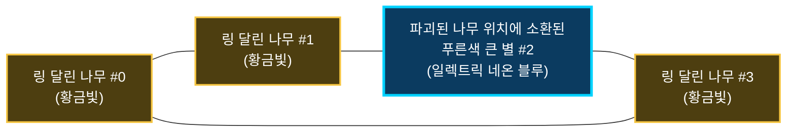

# 별자리 이음선 네트워크(Constellation Network) 연동 가이드

> **대상 독자**: 인게임 시스템(던전, 나무 오브젝트, VFX 매니저)에 별자리 이음선 네트워크를 연동하려는 프로그래머 및 AI 코딩 에이전트  
> **핵심 컴포넌트**: [`ConstellationDottedLine`](file:///d:/Unity/Project/Project_Baobab/Assets/Scripts/Presentation%20Layer/VFX/ConstellationLine/ConstellationDottedLine.cs)  
> **최신 검증일**: 2026-09-28

---

## 1. 시스템 개요 및 핵심 아키텍처 (System Architecture)

본 시스템은 **링(Halo) 표식이 달린 여러 그루의 나무들([`TreeObj`](file:///d:/Unity/Project/Project_Baobab/Assets/Scripts/Presentation%20Layer/ObjectSystem/TreeObj.cs))을 하나의 수려한 별자리 성도(다각형 폐곡선 또는 경로)로 연결**하고, **나무 파괴 시 소환되는 푸른색 큰 별([`TreeStarMarkGroundAnimator`](file:///d:/Unity/Project/Project_Baobab/Assets/Scripts/Presentation%20Layer/ComponentSystem/TreeVisualComponent/TreeStarMarkGroundAnimator.cs))과의 연결선을 선명한 황금빛 ↔ 푸른빛 네온 그라데이션으로 동적 전환**하는 최적화 VFX 솔루션입니다.



### 핵심 엔지니어링 특징
1. **1 Draw Call 보장**:
   - 연결되는 노드가 3그루이든 10그루이든, 수백 개의 발광 도트 빌보드 쿼드를 **단 하나의 절차적 서브메쉬(Procedural Mesh)로 병합**하여 렌더링 드로우콜을 **단 1회**로 묶습니다.
2. **Zero GC Alloc 파이프라인**:
   - 내부 정적 버퍼(버텍스, UV, 노멀, 컬러, 트라이앵글 인덱스)를 정적 캐시로 사전 풀링하고 무할당 List 오버로드(`SetVertices`, `SetColors` 등)만 전용 사용하여 **런타임 갱신 시 GC 발생 0 Bytes**를 보장합니다.
3. **URP 전용 동적 셰이더 ([`ConstellationDottedLine.shader`](file:///d:/Unity/Project/Project_Baobab/Assets/Shaders/VFX/ConstellationDottedLine.shader))**:
   - **지점 간 알파 감쇄 (Per-Segment Edge Fade)**: 노드 결착부 양끝 10% 구간에서 알파가 부드럽게 감쇄되어 나무 밑동/링에 띡 박히는 이질감을 완벽히 제거합니다.
   - **유선형 곡선 연속성**: 노드 결착부에서 지그재그 파동 변위가 `smoothstep`으로 0에 수렴하여 꺾임 없이 부드러운 유선형 곡선을 유지합니다.
   - **네온 블루 HDR 부스트 & 가산 시머(Shimmer)**: 푸른색 큰 별 연결 시 비대칭 65% 푸른빛 확장 곡선(`Mathf.Pow(t, 0.55f)`)과 가산 합성을 적용하여 URP Bloom 환경에서도 백색 표백 없이 청량한 일렉트릭 네온 블루를 유지합니다.
4. **별자리 꼬임 원천 방지 (Radial Angle Sorting)**:
   - 노드 배치 시 선분이 서로 교차하여 X자로 꼬이는 현상을 방지하기 위해, 무게중심(Centroid) 기준 원형 각도 정렬 알고리즘([`AutoUntangleNodes`](file:///d:/Unity/Project/Project_Baobab/Assets/Scripts/Presentation%20Layer/VFX/ConstellationLine/ConstellationDottedLine.cs#L390))을 내장하고 있습니다.

---

## 2. 에셋 및 리소스 참조 경로 (Asset References)

| 항목 | 에셋 절대 경로 | 설명 |
| :--- | :--- | :--- |
| **프리팹** | [`VFX_ConstellationDottedLine.prefab`](file:///d:/Unity/Project/Project_Baobab/Assets/Prefabs/VFX/Constellation/VFX_ConstellationDottedLine.prefab) | 풀링 및 씬 배치용 완성형 프리팹 (MeshFilter + MeshRenderer + 스크립트) |
| **스크립트** | [`ConstellationDottedLine.cs`](file:///d:/Unity/Project/Project_Baobab/Assets/Scripts/Presentation%20Layer/VFX/ConstellationLine/ConstellationDottedLine.cs) | 런타임 메쉬 생성, 동적 보간, 타겟 추적, 풀링 제어 컴포넌트 |
| **셰이더** | [`ConstellationDottedLine.shader`](file:///d:/Unity/Project/Project_Baobab/Assets/Shaders/VFX/ConstellationDottedLine.shader) | URP 기반 도트 발광, 펄스 파동 유영, 지점 간 알파 감쇄 셰이더 |
| **머티리얼** | [`M_ConstellationDottedLine.mat`](file:///d:/Unity/Project/Project_Baobab/Assets/Graphics/VFX/Materials/M_ConstellationDottedLine.mat) | 프리팹에 할당된 전용 URP 머티리얼 |
| **에디터 도구** | [`ConstellationDottedLineEditor.cs`](file:///d:/Unity/Project/Project_Baobab/Assets/Scripts/Presentation%20Layer/VFX/ConstellationLine/Editor/ConstellationDottedLineEditor.cs) | 씬 뷰 콕콕 클릭 배치 및 꼬임 자동 풀기 에디터 도구 (빌드 자동 제외) |

---

## 3. 핵심 데이터 구조 및 색상 규격 (Data Structures)

### `ConstellationNode` 구조체
각 별자리 연결 지점(노드)을 정의하는 핵심 구조체입니다.
```csharp
[System.Serializable]
public struct ConstellationNode
{
    public Vector3 position;       // 노드의 월드 좌표
    public bool isBigStar;         // true: 푸른색 큰 별 / false: 황금빛 나무
    public Transform target;       // 실시간 추적 대상 Transform (정적 위치일 경우 null)

    public ConstellationNode(Vector3 _pos, bool _isBigStar = false, Transform _target = null)
    {
        position = _pos;
        isBigStar = _isBigStar;
        target = _target;
    }
}
```

### 표준 색상 상수 규격
- **나무 (기본)**: `TreeGoldenColor` = `new Color(1.8f, 0.85f, 0.05f, 1.0f)` (따뜻하고 화사한 HDR 황금빛)
- **큰 별 (파괴 후)**: `BigStarBlueColor` = `new Color(0.0f, 0.65f, 2.4f, 1.0f)` (짙고 선명한 일렉트릭 네온 사이안 블루)

---

## 4. Public API 명세서 (API Reference)

모든 API는 [`ConstellationDottedLine`](file:///d:/Unity/Project/Project_Baobab/Assets/Scripts/Presentation%20Layer/VFX/ConstellationLine/ConstellationDottedLine.cs) 컴포넌트에 구현되어 있습니다.

### 1) 다중 노드 별자리 생성 및 초기화
```csharp
// 1. ConstellationNode 리스트를 전달하여 별자리 생성 (권장: 위치 + 큰별 여부 + 타겟 일괄 지정)
public void SetNodes(IReadOnlyList<ConstellationNode> _nodes, bool _isClosed = true);

// 2. Transform 타겟 리스트를 전달하여 생성 (모든 노드가 타겟의 이동을 실시간 추적)
public void SetTargets(IReadOnlyList<Transform> _targets, bool _isClosed = true);

// 3. 단순 월드 좌표 Vector3 리스트를 전달하여 생성
public void SetPoints(IReadOnlyList<Vector3> _points, bool _isClosed = true);
```

### 2) 큰 별 상태 전환 및 타겟 갱신 (핵심!)
```csharp
/// <summary>
/// 특정 인덱스의 노드를 '푸른색 큰 별'로 전환하거나 타겟을 갱신합니다.
/// 나무가 파괴되어 큰 별이 소환되었을 때 호출하면, 즉시 해당 노드 연결선이 황금빛 ↔ 푸른빛 그라데이션으로 자동 전환됩니다.
/// </summary>
/// <param name="_nodeIndex">전환할 노드 인덱스 (0 ~ N-1)</param>
/// <param name="_isBigStar">true: 푸른색 큰 별 / false: 황금빛 나무</param>
/// <param name="_newTarget">소환된 큰 별의 Transform (선택)</param>
public void SetNodeAsBigStar(int _nodeIndex, bool _isBigStar, Transform _newTarget = null);
```

### 3) 별자리 선 꼬임 방지 (Auto Untangle)
```csharp
/// <summary>
/// 노드들의 무게중심(Centroid) 기준 각도 순으로 정렬하여,
/// 선분이 서로 교차하지 않는 완벽한 단순 다각형(Simple Polygon) 성도를 형성합니다 (Zero GC).
/// </summary>
public void AutoUntangleNodes();
```

### 4) 소팅 레이어 및 오더 제어
```csharp
public void SetSortingOrder(string _layerName, int _order);
```

### 5) 오브젝트 풀링 제어
```csharp
public void SetPool(IObjectPool<ConstellationDottedLine> _pool);
public void ReturnToPool();       // 풀에 안전 반환 (풀 미주입 시 SetActive(false))
public void ForceReturnToPool();  // 외부 매니저 강제 회수용
```

---

## 5. 실전 인게임 연동 시나리오별 구현 예제 (Copy & Paste Code)

아래 예제 코드는 실제 인게임 매니저([`InDungeonObjectManager`](file:///d:/Unity/Project/Project_Baobab/Assets/Scripts/Application%20Layer/ObjectSystem/Dungeon/InDungeonObjectManager.cs)) 또는 신규 코디네이터에서 그대로 활용할 수 있도록 작성되었습니다.

### 시나리오 A: 던전 진입 시 별 표식 나무 그룹 연결
```csharp
using System.Collections.Generic;
using UnityEngine;

public class ConstellationManagerExample : MonoBehaviour
{
    [SerializeField] private ConstellationDottedLine constellationLinePrefab;
    
    // GC 방지를 위한 재사용 캐시 리스트
    private readonly List<ConstellationNode> cachedNodeBuffer = new List<ConstellationNode>(16);
    private ConstellationDottedLine activeLine;

    /// <summary>
    /// 같은 StarGroupId를 가진 별 표식 나무들을 별자리 네트워크로 연결합니다.
    /// </summary>
    public void ConnectStarTrees(int _targetGroupId, IReadOnlyList<TreeObj> _allTrees)
    {
        cachedNodeBuffer.Clear();

        // 1. 해당 그룹에 속한 별 표식 나무 수집
        for (int i = 0; i < _allTrees.Count; i++)
        {
            TreeObj tree = _allTrees[i];
            if (null != tree && true == tree.bStarMarked && tree.StarGroupId == _targetGroupId)
            {
                // 나무 상단 링(Halo) 위치를 기준 좌표로 설정 (추적용 Transform 전달)
                Vector3 ringWorldPos = tree.transform.position + new Vector3(0.0f, 1.2f, 0.0f);
                cachedNodeBuffer.Add(new ConstellationNode(ringWorldPos, false, tree.transform));
            }
        }

        if (2 > cachedNodeBuffer.Count) return;

        // 2. 별자리 선 인스턴스 준비 (풀링 또는 생성)
        if (null == activeLine)
        {
            activeLine = Instantiate(constellationLinePrefab);
            activeLine.SetSortingOrder("Environment", 5); // 바닥 위, 캐릭터/나무 줄기 아래 오더
        }

        // 3. 다중 노드 연결 (3개 이상이면 닫힌 다각형 루프)
        bool isClosed = 2 < cachedNodeBuffer.Count;
        activeLine.SetNodes(cachedNodeBuffer, isClosed);

        // 4. 선 꼬임 방지 1회 호출 (X자 교차 원천 방지)
        if (true == isClosed)
        {
            activeLine.AutoUntangleNodes();
        }
    }
}
```

### 시나리오 B: 나무 파괴 시 큰 별([`TreeStarMarkGroundAnimator`](file:///d:/Unity/Project/Project_Baobab/Assets/Scripts/Presentation%20Layer/ComponentSystem/TreeVisualComponent/TreeStarMarkGroundAnimator.cs)) 소환 및 푸른빛 그라데이션 전환
```csharp
    /// <summary>
    /// 별 표식 나무가 파괴되어 바닥에 큰 별이 소환되었을 때 호출합니다.
    /// </summary>
    public void OnStarTreeDestroyed(int _nodeIndex, TreeStarMarkGroundAnimator _starGroundMark)
    {
        if (null == activeLine) return;

        // 해당 노드를 '푸른색 큰 별'로 전환!
        // -> 연결선이 자동으로 [황금빛 나무 ↔ 푸른색 큰 별] 네온 그라데이션으로 즉시 바뀝니다.
        Transform starTransform = null != _starGroundMark ? _starGroundMark.transform : null;
        activeLine.SetNodeAsBigStar(_nodeIndex, true, starTransform);
    }
```

### 시나리오 C: 던전 클리어 / 웨이브 종료 시 회수
```csharp
    public void ClearConstellation()
    {
        if (null != activeLine)
        {
            activeLine.ReturnToPool();
            activeLine = null;
        }
        cachedNodeBuffer.Clear();
    }
```

---

## 6. 프로그래머 & AI 개발자 필독 주의사항 (Best Practices)

1. **Zero GC Alloc 보장**:
   - `SetNodes` 호출 시 매 프레임 `new List<ConstellationNode>()`를 생성하지 마십시오. 반드시 상단 예제처럼 멤버 필드로 캐싱된 `List<ConstellationNode>`를 선언하고 `Clear()` 후 재사용하십시오.
2. **소팅 오더 규칙**:
   - 별자리 점선은 지면(Ground Tile)보다는 위에, 나무 기둥(Tree Trunk)이나 플레이어보다는 아래에 위치해야 시각적 뎁스가 가장 아름답습니다. `SetSortingOrder("Environment", 5)` 또는 프로젝트의 표준 레이어를 적용하십시오.
3. **선 꼬임 방지(`AutoUntangleNodes`) 호출 타이밍**:
   - 초기 노드 설정(`SetNodes`) 직후 1회만 호출하면 충분합니다. 노드가 런타임에 이동하더라도 순서 관계는 유지되므로 매 프레임 호출할 필요가 없습니다.
4. **코딩 스타일 준수 (Yoda 표기법)**:
   - 본 프로젝트의 코딩 규칙에 따라 모든 조건문은 Yoda 표기법(`true == isClosed`, `null != activeLine`, `0 < nodes.Count`)을 엄격히 준수해야 합니다.
5. **에디터 프리팹 수정 금지**:
   - 프리팹 원본([`VFX_ConstellationDottedLine.prefab`](file:///d:/Unity/Project/Project_Baobab/Assets/Prefabs/VFX/Constellation/VFX_ConstellationDottedLine.prefab))의 인스펙터 기본값은 테스트용 5각 별자리로 세팅되어 있으므로, 런타임에서는 반드시 `SetNodes()`를 통해 실제 나무 위치를 주입하십시오.

---

## 7. 신규 별자리 픽셀 레이저 (ConstellationPixelLaser) 연쇄반응 연동 가이드

기존의 거친 지그재그 번개([`VFX_LightningLaser.prefab`](file:///d:/Unity/Project/Project_Baobab/Assets/Prefabs/VFX/Lightning/VFX_LightningLaser.prefab))를 대체하여, **처음 생성된 별부터 마지막 별까지 도미노처럼 삐용- 찍- 뻗어나가며 별들이 연쇄 폭발하는 신규 픽셀 레이저**입니다.

### 1) 핵심 리소스
- 프리팹: [`VFX_ConstellationPixelLaser.prefab`](file:///d:/Unity/Project/Project_Baobab/Assets/Prefabs/VFX/Constellation/VFX_ConstellationPixelLaser.prefab)
- 컴포넌트: [`ConstellationPixelLaser.cs`](file:///d:/Unity/Project/Project_Baobab/Assets/Scripts/Presentation%20Layer/VFX/ConstellationLine/ConstellationPixelLaser.cs)
- 셰이더: [`ConstellationPixelLaser.shader`](file:///d:/Unity/Project/Project_Baobab/Assets/Shaders/VFX/ConstellationPixelLaser.shader)

### 2) 순차 연쇄 발사 연동 코드 (InDungeonObjectManager 교체용)
```csharp
    // 별들이 시간 순서대로 보관된 리스트를 넘겨주면, 처음 별 -> 마지막 별까지 순서대로 찍- 가며 연쇄 폭발
    [SerializeField] private ConstellationPixelLaser pixelLaserPrefab;

    public void TriggerSequentialStarLaser(List<Vector3> _chronologicalStarPositions)
    {
        ConstellationPixelLaser laser = Instantiate(pixelLaserPrefab);
        
        // 레이저 헤드가 다음 별에 닿는 정밀한 순간마다 해당 별 폭발 연출 동기화
        laser.OnStarReachedEvent += (starIndex, starWorldPos) =>
        {
            // starIndex 번째 큰 별(TreeStarMarkGroundAnimator)의 소멸 연출 즉시 발동!
            // PlayStarExplosionVFX(starIndex);
        };

        // 도미노 연쇄 발사 시작 (폐곡선 여부 true/false)
        laser.PlaySequentialDominoLaser(_chronologicalStarPositions, _isClosedLoop: true);
    }
```

