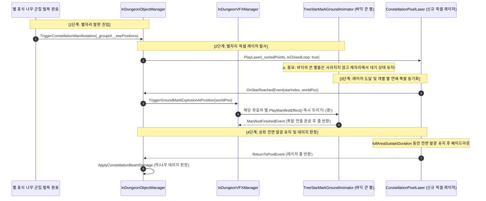

# 별자리 픽셀 레이저 (Constellation Pixel Laser) 인게임 실전 연동 구현 명세서

> **문서 대상자**: 본 프로젝트의 인게임 시스템(Dungeon/VFX)에 별자리 픽셀 레이저를 실제 적용할 프로그래머 또는 AI 코딩 에이전트.  
> **문서 목적**: [`ConstellationPixelLaser`](file:///d:/Unity/Project/Project_Baobab/Assets/Scripts/Presentation%20Layer/VFX/ConstellationLine/ConstellationPixelLaser.cs)를 인게임 바닥 큰 별([`TreeStarMarkGroundAnimator`](file:///d:/Unity/Project/Project_Baobab/Assets/Scripts/Presentation%20Layer/ComponentSystem/TreeVisualComponent/TreeStarMarkGroundAnimator.cs)) 및 던전 매니저([`InDungeonObjectManager`](file:///d:/Unity/Project/Project_Baobab/Assets/Scripts/Application%20Layer/ObjectSystem/Dungeon/InDungeonObjectManager.cs))와 결합하여, **"레이저가 별들을 향해 동시 발사되고 닿는 순간 별들이 연쇄 폭발하는 연출"**을 단 한 번의 오차 없이 완벽히 구현할 수 있도록 정밀 가이드를 제공합니다.

---

## 1. 아키텍처 개요 및 런타임 제어 흐름 (Runtime Flow)

### A. 기존 구형 흐름 vs 신규 연동 흐름 비교



---

## 2. ⚠️ 작업자가 반드시 주의해야 할 5대 치명적 잠재 결함 및 해결책 (Critical Pitfalls)

다른 에이전트나 프로그래머가 작업할 때 **가장 빈번하게 버그를 유발할 수 있는 5가지 위험 요소**와 그 완벽한 해결책입니다.

### 1) [치명적] 별 인덱스 불일치 버그 (Spatial Index Mismatch)
- **현상**: 레이저가 닿는 순간 엉뚱한 위치에 있는 별이 터지거나 폭발이 밀리는 현상.
- **원인**:
  - 나무가 벌목될 때마다 순차적으로 스폰되어 [`InDungeonVFXManager`](file:///d:/Unity/Project/Project_Baobab/Assets/Scripts/Application%20Layer/ObjectSystem/Dungeon/InDungeonVFXManager.cs)의 `activeGroundMarksByGroup[_groupId]` 리스트에 저장된 순서는 **"나무가 잘려나간 시간 순서"**입니다.
  - 반면 [`InDungeonObjectManager`](file:///d:/Unity/Project/Project_Baobab/Assets/Scripts/Application%20Layer/ObjectSystem/Dungeon/InDungeonObjectManager.cs)의 `BuildSimplePolygonPath` 또는 [`ConstellationPixelLaser.UntanglePoints`](file:///d:/Unity/Project/Project_Baobab/Assets/Scripts/Presentation%20Layer/VFX/ConstellationLine/ConstellationPixelLaser.cs#L1857)를 거치면 좌표 리스트는 **"원주 각도 순서(시계/반시계)"**로 재정렬됩니다.
  - 따라서 단순 정수 인덱스(`starIndex`)로 마크 리스트에 접근하면(`activeGroundMarksByGroup[_groupId][starIndex]`) 물리적 위치가 전혀 일치하지 않습니다.
- **해결책**:
  - `starIndex`를 신뢰하지 말고, [`OnStarReachedEvent(int starIndex, Vector3 worldPos)`](file:///d:/Unity/Project/Project_Baobab/Assets/Scripts/Presentation%20Layer/VFX/ConstellationLine/ConstellationPixelLaser.cs#L26)에서 전달되는 **`worldPos`를 기준으로 해당 그룹 내에서 거리가 가장 가까운(최근접 SqrMagnitude) [`TreeStarMarkGroundAnimator`](file:///d:/Unity/Project/Project_Baobab/Assets/Scripts/Presentation%20Layer/ComponentSystem/TreeVisualComponent/TreeStarMarkGroundAnimator.cs) 인스턴스를 찾아 폭발**시켜야 합니다 (0.5m 이내 매칭).

### 2) [치명적] 폐곡선 중복 좌표 주입 충돌 (Closed-Loop Double Edge Bug)
- **현상**: 레이저의 마지막 별과 첫 별 사이에 길이가 0인 잉여 선분이 중복 생성되어 깜빡이거나 각도 꼬임 발생.
- **원인**:
  - 기존 [`InDungeonObjectManager.BuildSimplePolygonPath`](file:///d:/Unity/Project/Project_Baobab/Assets/Scripts/Application%20Layer/ObjectSystem/Dungeon/InDungeonObjectManager.cs#L2302)는 `if (sorted.Count >= 3) sorted.Add(sorted[0]);` 형태로 마지막 인덱스에 첫 점을 중복 삽입했습니다.
  - 반면 신규 [`ConstellationPixelLaser.PlayLaser(points, isClosedLoop: true)`](file:///d:/Unity/Project/Project_Baobab/Assets/Scripts/Presentation%20Layer/VFX/ConstellationLine/ConstellationPixelLaser.cs#L281)는 `isClosedLoop` 플래그를 통해 자체적으로 `(i + 1) % ptCount`로 루프를 닫습니다.
  - `sorted[0]`가 중복 추가된 리스트를 `isClosedLoop: true`로 전달하면 `sorted[N-1] -> sorted[0]` 선분이 2중으로 생성됩니다.
- **해결책**:
  - `ConstellationPixelLaser`에 전달하는 좌표 리스트에는 **마지막 중복점(`sorted[0]`)을 절대 추가하지 마십시오.** 고유한 N개의 별 좌표만 전달하고 `_isClosedLoop = (3 <= count)`로 넘겨야 합니다.

### 3) [필수 방어] 상호 양방향 동시 도달 중복 트리거 방지 (Dual-Hit De-duplication)
- **현상**: 한 별에서 소멸 연출이나 사운드가 2번 중복 재생되는 현상.
- **원인**:
  - `ConstellationPixelLaser`는 '상호 양방향 전면 동시 발사' 모드로 고정되어 있습니다. 각 변마다 $A \to B$, $B \to A$ 두 줄기가 날아가므로, 별 B 입장에서는 인접한 별 A와 별 C 양쪽에서 날아온 빔이 거의 동시에 도달하여 [`OnStarReachedEvent`](file:///d:/Unity/Project/Project_Baobab/Assets/Scripts/Presentation%20Layer/VFX/ConstellationLine/ConstellationPixelLaser.cs#L26)가 2회 호출될 수 있습니다.
- **해결책**:
  - 다행히 [`TreeStarMarkGroundAnimator.PlayManifestEffect()`](file:///d:/Unity/Project/Project_Baobab/Assets/Scripts/Presentation%20Layer/ComponentSystem/TreeVisualComponent/TreeStarMarkGroundAnimator.cs#L172) 내부에서 이미 `AnimationState.Manifest` 검사로 중복 진입을 방어하고 있습니다.
  - 그러나 안전성을 위해 매니저 단에서도 `HashSet<TreeStarMarkGroundAnimator> explodedMarks`를 두어 한 번 터진 마크는 두 번 다시 호출하지 않도록 확실히 필터링해야 합니다.

### 4) 기존 비동기 대기 구조의 역전 (Sequence Inversion)
- **현상**: 레이저가 발사되지 않고 멈춰버리거나(Hang), 별이 사라진 뒤 엉뚱하게 발사되는 현상.
- **원인**:
  - 기존에는 `ClearConstellationGroundMarks` $\rightarrow$ 모든 별이 터질 때까지 대기 $\rightarrow$ `ConstellationManifestReadyEvent` 수신 $\rightarrow$ 레이저 발사 순서였습니다.
  - 신규 연출에서는 **"레이저 발사 $\rightarrow$ 레이저가 도달할 때 별 폭발"**로 인과관계가 정반대입니다.
- **해결책**:
  - `InDungeonObjectManager`에서 `ConstellationManifestReadyEvent`를 기다리는 비동기 코루틴 진입점을 거치지 않고, `TriggerConstellationManifestation` 확정 즉시 레이저를 바로 발사하도록 구조를 단순화해야 합니다.

### 5) 던전 퇴장 및 스테이지 리셋 시 풀링 무결성 (Lifecycle Clean-up)
- **현상**: 레이저가 날아가던 도중 플레이어가 던전을 나가거나 죽으면 레이저가 다음 런의 씬에 둥둥 떠 있는 현상.
- **원인**:
  - `InDungeonObjectManager.ClearObjManager()` 시점에 진행 중이던 레이저 인스턴스를 강제 회수하지 않으면 댕글링 오브젝트가 발생합니다.
- **해결책**:
  - 발사된 `ConstellationPixelLaser` 인스턴스들을 매니저의 `activeLasers` 리스트로 추적하고, 던전 클리어/퇴장 시 `laser.ReturnToPool()`을 일괄 호출해야 합니다.

---

## 3. 핵심 컴포넌트 구현 및 수정 가이드

### A. [신규 파일] [`ConstellationPixelLaserCreator.cs`](file:///d:/Unity/Project/Project_Baobab/Assets/Scripts/Presentation%20Layer/VFX/ConstellationPixelLaserCreator.cs)
기존의 [`LightningZapCreator`](file:///d:/Unity/Project/Project_Baobab/Assets/Scripts/Presentation%20Layer/VFX/LightningZapCreator.cs)와 100% 동일한 구조로 신규 픽셀 레이저를 무할당(Zero GC) 관리하는 풀러 컴포넌트입니다.

- **위치**: `Assets/Scripts/Presentation Layer/VFX/ConstellationPixelLaserCreator.cs`
- **구현 코드 전문**:
```csharp
using UnityEngine;
using UnityEngine.Pool;

namespace PresentationLayer.VFX
{
    /// <summary>
    /// ConstellationPixelLaser 전용 런타임 오브젝트 풀러.
    /// InDungeonObjectManager에서 별자리 발현 시 레이저 인스턴스를 무할당(Zero GC)으로 대여 및 자동 반환합니다.
    /// </summary>
    public class ConstellationPixelLaserCreator : MonoBehaviour
    {
        [SerializeField] private ConstellationPixelLaser laserPrefab;
        [SerializeField] private int defaultCapacity = 4;
        [SerializeField] private int maxSize = 16;

        private IObjectPool<ConstellationPixelLaser> laserPool;

        public void Initialize()
        {
            if (null != laserPool) return;

            laserPool = new ObjectPool<ConstellationPixelLaser>(
                createFunc: CreateLaser,
                actionOnGet: OnGetLaser,
                actionOnRelease: OnReleaseLaser,
                actionOnDestroy: OnDestroyLaser,
                collectionCheck: true,
                defaultCapacity: defaultCapacity,
                maxSize: maxSize
            );
        }

        public ConstellationPixelLaser Get()
        {
            if (null == laserPool)
            {
                Initialize();
            }
            return laserPool.Get();
        }

        private ConstellationPixelLaser CreateLaser()
        {
            ConstellationPixelLaser instance = Instantiate(laserPrefab, transform);
            instance.SetPool(laserPool);
            return instance;
        }

        private void OnGetLaser(ConstellationPixelLaser _laser)
        {
            _laser.gameObject.SetActive(true);
        }

        private void OnReleaseLaser(ConstellationPixelLaser _laser)
        {
            _laser.gameObject.SetActive(false);
        }

        private void OnDestroyLaser(ConstellationPixelLaser _laser)
        {
            if (null != _laser)
            {
                Destroy(_laser.gameObject);
            }
        }
    }
}
```

---

### B. [`InDungeonVFXManager.cs`](file:///d:/Unity/Project/Project_Baobab/Assets/Scripts/Application%20Layer/ObjectSystem/Dungeon/InDungeonVFXManager.cs) 수정 내용

레이저 도달 시 특정 월드 좌표에 있는 큰 별을 즉시 폭발시키는 메서드를 추가합니다.

#### 1) 메서드 추가 (라인 346 부근에 추가)
```csharp
    /// <summary>
    /// 레이저 선단이 특정 좌표에 도달했을 때, 해당 위치에 있는 그라운드 마크의 소멸(폭발) 연출을 즉시 트리거합니다 (Zero GC).
    /// </summary>
    public void TriggerGroundMarkExplosionAtPosition(int _groupId, Vector3 _worldPos, float _matchThreshold = 1.0f)
    {
        if (false == activeGroundMarksByGroup.TryGetValue(_groupId, out List<TreeStarMarkGroundAnimator> _list) || null == _list)
        {
            return;
        }

        float thresholdSq = _matchThreshold * _matchThreshold;
        float minDistSq = float.MaxValue;
        TreeStarMarkGroundAnimator targetMark = null;

        for (int i = 0; i < _list.Count; i++)
        {
            TreeStarMarkGroundAnimator mark = _list[i];
            if (null == mark) continue;

            float dSq = (mark.transform.position - _worldPos).sqrMagnitude;
            if (dSq < thresholdSq && dSq < minDistSq)
            {
                minDistSq = dSq;
                targetMark = mark;
            }
        }

        if (null != targetMark)
        {
            pendingManifestInstances.Add(targetMark);
            targetMark.PlayManifestEffect();
        }
    }
```

---

### C. [`InDungeonObjectManager.cs`](file:///d:/Unity/Project/Project_Baobab/Assets/Scripts/Application%20Layer/ObjectSystem/Dungeon/InDungeonObjectManager.cs) 수정 내용

기존의 `lightningZapCreator` 대신 `ConstellationPixelLaserCreator`를 바인딩하고, 별 소멸과 레이저 도달 이벤트를 직결합니다.

#### 1) 필드 교체 (라인 333 부근)
```csharp
    // [기존 구형 필드 대체]
    // [SerializeField] private LightningZapCreator lightningZapCreator;
    [SerializeField] private PresentationLayer.VFX.ConstellationPixelLaserCreator pixelLaserCreator;
    private readonly List<PresentationLayer.VFX.ConstellationPixelLaser> activePixelLasers = new List<PresentationLayer.VFX.ConstellationPixelLaser>(4);
```

#### 2) 초기화 바인딩 (라인 420 부근)
```csharp
    pixelLaserCreator?.Initialize();
```

#### 3) `TriggerConstellationManifestation` 파이프라인 전면 개편 (라인 2264 부근)
```csharp
    public void TriggerConstellationManifestation(int _groupId, List<Vector3> _starPositions)
    {
        if (false == bConstellationManifestUnlocked) return;
        if (null == _starPositions || 2 > _starPositions.Count) return;

        // 재귀 호출 방어 (재진입 방지)
        if (true == activeConstellationGroups.Contains(_starPositions)) return;
        activeConstellationGroups.Add(_starPositions);

        // 1. 단순 다각형 고유 좌표 정렬 (끝점 중복 제거!)
        List<Vector3> cleanPolygon = BuildUniquePolygonPath(_starPositions);
        bool bIsClosedLoop = (3 <= cleanPolygon.Count);

        // 2. 신규 픽셀 레이저 인스턴스 획득 및 발사
        PresentationLayer.VFX.ConstellationPixelLaser laser = pixelLaserCreator?.Get();
        if (null == laser) return;

        activePixelLasers.Add(laser);

        // 3. 레이저가 별에 닿는 순간 바닥 큰 별 개별 폭발 연동!
        int targetGroupId = _groupId;
        laser.OnStarReachedEvent += (starIndex, starPos) =>
        {
            inDungeonVFXManager?.TriggerGroundMarkExplosionAtPosition(targetGroupId, starPos);
        };

        laser.ReturnToPoolEvent += (returnedLaser) =>
        {
            activePixelLasers.Remove(returnedLaser);
        };

        // 4. 발사 실행!
        laser.PlayLaser(cleanPolygon, bIsClosedLoop);

        // 5. 데미지 판정 코루틴 실행
        float damage = BaseConstellationDamage * Mathf.Max(0f, constellationDamageMultiplier);
        int hitCount = Mathf.Max(1, constellationHitCount);
        StartCoroutine(ConstellationBeamRoutine(_starPositions, cleanPolygon, damage, hitCount));
    }
```

#### 4) 고유 좌표 정렬 함수 `BuildUniquePolygonPath` (라인 2302 교체)
```csharp
    private List<Vector3> BuildUniquePolygonPath(List<Vector3> _points)
    {
        List<Vector3> sorted = new List<Vector3>(_points);
        Vector3 centroid = Vector3.zero;
        for (int i = 0; i < sorted.Count; i++) centroid += sorted[i];
        centroid /= (float)sorted.Count;

        // 2:1 아이소메트릭 보정 각도 정렬
        sorted.Sort((a, b) =>
        {
            float angleA = Mathf.Atan2((a.y - centroid.y) * 2f, a.x - centroid.x);
            float angleB = Mathf.Atan2((b.y - centroid.y) * 2f, b.x - centroid.x);
            return angleA.CompareTo(angleB);
        });

        // ⚠️ 주의: sorted.Add(sorted[0])를 절대 하지 않습니다!
        // ConstellationPixelLaser 내부에서 _isClosedLoop 플래그로 닫힌 루프를 자체 처리합니다.
        return sorted;
    }
```

#### 5) 던전 정리 시 레이저 강제 회수 (`ClearObjManager` 내부)
```csharp
    for (int i = activePixelLasers.Count - 1; 0 <= i; i--)
    {
        if (null != activePixelLasers[i])
        {
            activePixelLasers[i].ReturnToPool();
        }
    }
    activePixelLasers.Clear();
```

---

## 4. 인스펙터 바인딩 및 프리팹 세팅 체크리스트

다른 작업자는 코드를 수정한 뒤 Unity 에디터에서 다음 사항을 반드시 검수해야 합니다:

- [ ] **InDungeonObjectManager 프리팹/오브젝트**:
  - `InDungeonObjectManager` 게임오브젝트에 [`ConstellationPixelLaserCreator.cs`](file:///d:/Unity/Project/Project_Baobab/Assets/Scripts/Presentation%20Layer/VFX/ConstellationPixelLaserCreator.cs) 컴포넌트를 부착했는가?
  - `pixelLaserCreator` 슬롯에 해당 컴포넌트를 연결했는가?
  - `ConstellationPixelLaserCreator`의 `Laser Prefab` 슬롯에 [`VFX_ConstellationPixelLaser.prefab`](file:///d:/Unity/Project/Project_Baobab/Assets/Prefabs/VFX/Constellation/VFX_ConstellationPixelLaser.prefab)을 드래그하여 등록했는가?
- [ ] **소팅 레이어 및 오더 일치**:
  - `VFX_ConstellationPixelLaser.prefab`의 소팅 레이어가 `FlyingItem`, Order가 `10`으로 설정되어 나무/캐릭터 위에 정상 렌더링되는가?
- [ ] **Yoda 표기법 준수**:
  - 모든 조건문이 `true == isClosed`, `null != laser`, `2 > count` 형태를 준수하고 있는가?
- [ ] **Zero GC 보장**:
  - Update나 실시간 이벤트 핸들러에서 불필요한 `new List<Vector3>()` 람다 캡처 할당이 발생하지 않는지 프로파일러로 검증했는가?
