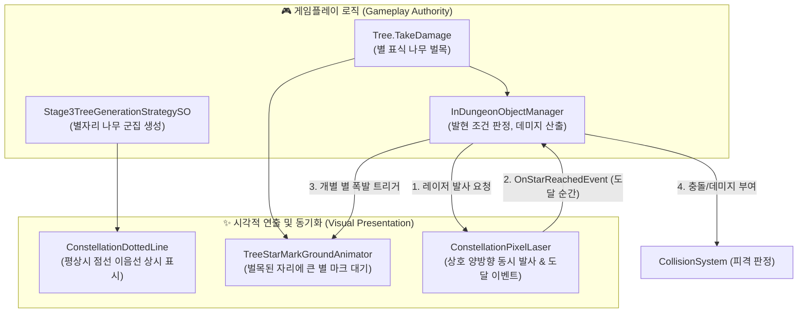
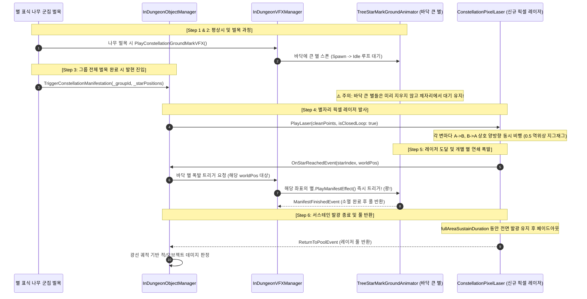

# 별자리 VFX 올인원 통합 연동 가이드 (Constellation Complete Integration Guide)

> **문서 대상자**: 본 프로젝트의 별자리 이음선 및 레이저 발현 시스템을 연동/유지보수할 클라이언트 프로그래머 및 AI 코딩 에이전트.  
> **문서 목적**: 평상시 표시되는 **별자리 점선 이음선([`VFX_ConstellationDottedLine`](file:///d:/Unity/Project/Project_Baobab/Assets/Prefabs/VFX/Constellation/VFX_ConstellationDottedLine.prefab))**부터 나무 군집 벌목 시 발동하는 **별자리 픽셀 레이저([`VFX_ConstellationPixelLaser`](file:///d:/Unity/Project/Project_Baobab/Assets/Prefabs/VFX/Constellation/VFX_ConstellationPixelLaser.prefab))**와 바닥 큰 별([`TreeStarMarkGroundAnimator`](file:///d:/Unity/Project/Project_Baobab/Assets/Scripts/Presentation%20Layer/ComponentSystem/TreeVisualComponent/TreeStarMarkGroundAnimator.cs))의 연쇄 폭발까지, 전체 라이프사이클의 **기능별 호출 장소 및 시점(When & Where)**과 **설계 시 추론해야 할 제약조건**을 명세합니다. (특정 코드 복사-붙여넣기를 강제하지 않으며, 각 시스템의 역할과 인터페이스를 기반으로 최선의 설계를 도출하도록 안내합니다.)

---

## 1. 시스템 목적 및 역할 분담 (Architecture & Authority)

본 시스템은 **"게임플레이 판정(Gameplay Authority)"**과 **"시각적 연출 및 타이밍 전달(Visual Timing Delivery)"**이 엄격하게 분리된 옵저버/이벤트 기반 아키텍처로 동작합니다.

### 💡 핵심 책임 원칙
1. **발현 조건 판정 (Gameplay Authority)**:
   - 레이저 이펙트 자체가 별 폭발을 스스로 결정하지 않습니다.
   - [`InDungeonObjectManager`](file:///d:/Unity/Project/Project_Baobab/Assets/Scripts/Application%20Layer/ObjectSystem/Dungeon/InDungeonObjectManager.cs)가 "해당 그룹의 모든 별 표식 나무가 벌목되었는가"를 100% 판단합니다.
2. **시각적 폭발 타이밍 전달 (Visual Timing Delivery)**:
   - 레이저 빔([`ConstellationPixelLaser`](file:///d:/Unity/Project/Project_Baobab/Assets/Scripts/Presentation%20Layer/VFX/ConstellationLine/ConstellationPixelLaser.cs))은 물리적/시간적으로 비행하여 목표 별에 도달하는 바로 그 프레임에 [`OnStarReachedEvent(starIndex, worldPos)`](file:///d:/Unity/Project/Project_Baobab/Assets/Scripts/Presentation%20Layer/VFX/ConstellationLine/ConstellationPixelLaser.cs#L26) 신호를 발생시킵니다.
3. **완벽한 비주얼 동기화 (Visual Synchronization)**:
   - 관리 컴포넌트가 임의의 추정 타이머로 별을 터뜨리는 것이 아니라, 레이저가 별에 정확히 닿는 순간 바닥 큰 별([`TreeStarMarkGroundAnimator`](file:///d:/Unity/Project/Project_Baobab/Assets/Scripts/Presentation%20Layer/ComponentSystem/TreeVisualComponent/TreeStarMarkGroundAnimator.cs))의 소멸 연출을 트리거하여 어떤 속도/거리에서도 오차 없는 싱크를 유지합니다.

---

## 2. 전체 런타임 제어 흐름 (Runtime Control Flow)

---

## 3. 핵심 컴포넌트별 역할 및 제공 인터페이스 (Component Specifications)

### 1) [`ConstellationDottedLine`](file:///d:/Unity/Project/Project_Baobab/Assets/Scripts/Presentation%20Layer/VFX/ConstellationLine/ConstellationDottedLine.cs) (평상시 점선 이음선)
- **주요 역할**: 별자리 나무들이 살아있는 동안 나무와 나무 사이를 잇는 32 PPU 픽셀 격자 정렬 절차적 점선 메쉬 렌더링.
- **리소스**:
  - 프리팹: [`Assets/Prefabs/VFX/Constellation/VFX_ConstellationDottedLine.prefab`](file:///d:/Unity/Project/Project_Baobab/Assets/Prefabs/VFX/Constellation/VFX_ConstellationDottedLine.prefab)
  - 머티리얼: `M_ConstellationDottedLine.mat`
- **주요 인터페이스 (API)**:
  - `public void SetNodes(List<Vector3> _points, bool _isClosedLoop = true)`: 전달된 월드 좌표들을 연결하는 점선 네트워크 메쉬 생성 및 렌더링 시작.
  - `public void Clear()`: 절차적 메쉬 데이터 초기화 및 렌더링 중단.
  - `public void UpdateDynamicPoints(List<Vector3> _points)`: 나무의 실시간 이동/흔들림에 따른 점선 좌표 동적 업데이트.
- **주요 속성 (Inspector)**:
  - `PixelUnit`: 기본 0.03125f (1/32).
  - `StartColor` / `EndColor`: 네온 그라데이션 컬러.
  - `AutoUntangle`: 2:1 아이소메트릭 외곽선 자동 정돈 여부.

---

### 2) [`ConstellationPixelLaser`](file:///d:/Unity/Project/Project_Baobab/Assets/Scripts/Presentation%20Layer/VFX/ConstellationLine/ConstellationPixelLaser.cs) (발현 시 픽셀 레이저)
- **주요 역할**: 모든 별 표식 나무 벌목 완료 시, 별들을 향해 상호 양방향(Mutual Simultaneous) 픽셀 레이저를 발사하고, 선단이 별에 닿는 순간 정확한 타이밍 이벤트를 송출.
- **리소스**:
  - 프리팹: [`Assets/Prefabs/VFX/Constellation/VFX_ConstellationPixelLaser.prefab`](file:///d:/Unity/Project/Project_Baobab/Assets/Prefabs/VFX/Constellation/VFX_ConstellationPixelLaser.prefab)
  - 셰이더: [`ConstellationPixelLaser.shader`](file:///d:/Unity/Project/Project_Baobab/Assets/Shaders/VFX/ConstellationPixelLaser.shader)
  - 머티리얼: [`M_ConstellationPixelLaser.mat`](file:///d:/Unity/Project/Project_Baobab/Assets/Graphics/VFX/Materials/M_ConstellationPixelLaser.mat)
- **주요 인터페이스 (API & Events)**:
  - `public void PlayLaser(IReadOnlyList<Vector3> points, bool isClosedLoop = true)`:
    - 상호 양방향 동시 발사 루틴 개시.
    - 각 변마다 정방향($A \to B$)과 역방향($B \to A$) 2줄기 빔이 0.5 역위상 지그재그를 그리며 동시 비행.
  - `public event Action<int, Vector3> OnStarReachedEvent`:
    - 빔의 선단이 목표 별에 도달하는 프레임에 발생.
    - 매개변수: `(int starIndex, Vector3 worldPos)`.
  - `public event Action<ConstellationPixelLaser> ReturnToPoolEvent`:
    - 비행 완료 $\rightarrow$ 서스테인 발광 지속 $\rightarrow$ 페이드아웃 종료 후 풀 반환 시점에 발생.
  - `public void SetPool(IObjectPool<ConstellationPixelLaser> pool)`: 오브젝트 풀 연동.
  - `public void ReturnToPool()`: 외부 강제 중단 및 풀 회수.
- **유틸리티 (정적/인스턴스 함수)**:
  - `public static List<Vector3> UntanglePoints(List<Vector3> rawPoints, int startIdx = 0)`: 2:1 투영 꼬임 풀기 알고리즘을 독립적으로 활용할 때 사용.

---

### 3) [`TreeStarMarkGroundAnimator`](file:///d:/Unity/Project/Project_Baobab/Assets/Scripts/Presentation%20Layer/ComponentSystem/TreeVisualComponent/TreeStarMarkGroundAnimator.cs) (바닥 큰 별 마크)
- **주요 역할**: 벌목된 별 표식 나무 자리에 남아 바닥에서 회전/발광 대기하며, 레이저 신호를 받아 폭발(Manifest) 및 소멸 연출 수행.
- **리소스**:
  - 프리팹: `Assets/Prefabs/VFX/Constellation/TreeStarMark_Ground.prefab` (또는 해당 풀러 프리팹)
- **주요 인터페이스 (API & Events)**:
  - `public void Play(bool isFlipped = false)`: 스폰 연출 후 `Idle` 루프 상태로 대기.
  - `public void PlayManifestEffect()`: 대기 상태에서 발현 폭발 연출로 즉시 전이 (쾅 연출 후 소멸).
  - `public event Action<TreeStarMarkGroundAnimator> ManifestFinishedEvent`: 폭발 연출 완료 후 풀 반환 시점에 송출.
  - `public void ForceReturnToPool()`: 던전 리셋/클리어 시 강제 즉시 회수.

---

## 4. 기능별 사용 장소 및 호출 시점 (When & Where Trigger Specification)

클라이언트 프로그래머 및 에이전트는 다음 5개 단계의 **발생 시점(When)**과 **호출 장소(Where)**를 준수하여 연동을 구성해야 합니다.

| 단계 | 시점 (When) | 장소 (Where) | 수행할 기능 및 액션 (What) |
| :--- | :--- | :--- | :--- |
| **Step 1: 군집 생성** | 던전 맵 생성 및 별자리 나무 그룹 스폰 시 | 던전 생성기 또는 트리 매니저 ([`Stage3TreeGenerationStrategySO`](file:///d:/Unity/Project/Project_Baobab/Assets/Scripts/Application%20Layer/ObjectSystem/Dungeon/Strategy/Stage3TreeGenerationStrategySO.cs) 등) | 군집에 속한 나무들의 위치(`List<Vector3>`)를 [`ConstellationDottedLine`](file:///d:/Unity/Project/Project_Baobab/Assets/Scripts/Presentation%20Layer/VFX/ConstellationLine/ConstellationDottedLine.cs)에 주입하여 평상시 점선 이음선 표시. |
| **Step 2: 나무 벌목** | 플레이어가 별 표식 나무를 타격하여 체력이 0이 되었을 때 | 나무 사망 처리 부 ([`Tree`](file:///d:/Unity/Project/Project_Baobab/Assets/Scripts/Domain%20Layer/Entity/Dungeon/Object/Tree.cs) / [`InDungeonObjectManager`](file:///d:/Unity/Project/Project_Baobab/Assets/Scripts/Application%20Layer/ObjectSystem/Dungeon/InDungeonObjectManager.cs) / [`InDungeonVFXManager`](file:///d:/Unity/Project/Project_Baobab/Assets/Scripts/Application%20Layer/ObjectSystem/Dungeon/InDungeonVFXManager.cs)) | 쓰러진 나무 위치에 바닥 큰 별([`TreeStarMarkGroundAnimator`](file:///d:/Unity/Project/Project_Baobab/Assets/Scripts/Presentation%20Layer/ComponentSystem/TreeVisualComponent/TreeStarMarkGroundAnimator.cs))을 스폰하여 바닥 대기(`Play`) 상태로 유지. |
| **Step 3: 발현 시작** | 해당 그룹의 모든 별 표식 나무가 벌목 완료되었을 때 | 별자리 발현 진입점 ([`InDungeonObjectManager.TriggerConstellationManifestation`](file:///d:/Unity/Project/Project_Baobab/Assets/Scripts/Application%20Layer/ObjectSystem/Dungeon/InDungeonObjectManager.cs#L2264)) | 1. **주의**: 바닥의 큰 별들을 미리 폭발시키거나 삭제하지 않고 제자리 대기를 유지. 2. 신규 레이저 풀러에서 [`ConstellationPixelLaser`](file:///d:/Unity/Project/Project_Baobab/Assets/Scripts/Presentation%20Layer/VFX/ConstellationLine/ConstellationPixelLaser.cs)를 대여. 3. `OnStarReachedEvent` 및 `ReturnToPoolEvent` 리스너 바인딩. 4. 정돈된 고유 외곽선 좌표로 `PlayLaser()` 실행. |
| **Step 4: 도달 및 폭발** | 레이저 선단이 목표 별에 도달하는 순간 | 레이저 이벤트 핸들러 ([`ConstellationPixelLaser.OnStarReachedEvent`](file:///d:/Unity/Project/Project_Baobab/Assets/Scripts/Presentation%20Layer/VFX/ConstellationLine/ConstellationPixelLaser.cs#L26) 콜백) | 이벤트로 전달받은 위치(`worldPos`)에 위치한 바닥 큰 별의 [`PlayManifestEffect()`](file:///d:/Unity/Project/Project_Baobab/Assets/Scripts/Presentation%20Layer/ComponentSystem/TreeVisualComponent/TreeStarMarkGroundAnimator.cs#L172)를 즉시 호출하여 개별 폭발 연출 동기화. |
| **Step 5: 정리 및 회수** | 레이저 연출 종료 시 또는 던전 퇴장/플레이어 사망/리셋 시 | 레이저 풀 반환 핸들러 및 매니저 정리 함수 ([`ClearObjManager`](file:///d:/Unity/Project/Project_Baobab/Assets/Scripts/Application%20Layer/ObjectSystem/Dungeon/InDungeonObjectManager.cs#L432)) | 1. 발현 중인 모든 레이저 인스턴스 반환. 2. 잔여 바닥 큰 별 인스턴스 강제 회수 (`ForceReturnToPool`). 3. 활성 상태 목록 초기화. |

---

## 5. 설계 시 에이전트가 추론 및 해결해야 할 핵심 제약사항 (Constraints & Considerations)

다른 에이전트나 개발자가 시스템을 구현할 때 반드시 고려하여 최적의 설계를 도출해야 하는 **5대 엣지 케이스 및 기술적 제약조건**입니다.

### 1) 공간 인덱스 불일치 해결 (Spatial Matching vs Indexing)
- **문제점**:
  - 나무 벌목 시 스폰된 바닥 별 마크 리스트(`activeGroundMarksByGroup[_groupId]`)는 **"나무가 벌목된 시간 순서"**로 누적됩니다.
  - 반면 레이저 발사 좌표는 **"원주 각도 순서(시계/반시계)"**로 정렬되어 있습니다.
  - 따라서 `OnStarReachedEvent(starIndex, worldPos)`에서 `starIndex`를 그대로 마크 리스트의 배열 인덱스로 사용하면 **엉뚱한 위치의 별이 폭발**합니다.
- **추론 가이드**:
  - `starIndex` 대신 이벤트와 함께 전달되는 `worldPos`를 활용해야 합니다.
  - 해당 그룹의 활성 마크들 중 `worldPos`와의 거리 제곱(`sqrMagnitude`)이 일정 임계값(예: 1.0m 이내) 이하인 가장 가까운 마크를 선별하여 트리거하는 공간 매칭(Spatial Matching) 로직을 설계하십시오.

### 2) 폐곡선 중복 좌표 주입 방지 (Closed-Loop Path Duplication)
- **문제점**:
  - 기존 구형 코드의 일부 경로 생성 함수는 폐곡선을 만들기 위해 리스트 끝에 시작점을 다시 추가(`sorted.Add(sorted[0])`)하는 방식을 사용했습니다.
  - 신규 [`ConstellationPixelLaser.PlayLaser`](file:///d:/Unity/Project/Project_Baobab/Assets/Scripts/Presentation%20Layer/VFX/ConstellationLine/ConstellationPixelLaser.cs#L281)는 `isClosedLoop: true` 전달 시 내부에서 자동으로 `(i + 1) % ptCount` 모듈러 연산으로 끝점과 시작점을 연결합니다.
  - 만약 호출자가 리스트 끝에 시작점을 중복 추가한 채로 넘기면, 마지막 변의 길이가 `0`이 되어 렌더링 꼬임, 나눗셈 예외, 혹은 빔 깜빡임이 발생합니다.
- **추론 가이드**:
  - `PlayLaser`에 전달하는 좌표 리스트는 반드시 **고유한 N개의 꼭짓점 좌표**만 포함하도록 구성하십시오.

### 3) 상호 양방향 발사에 따른 중복 도달 방어 (Dual-Hit De-duplication)
- **문제점**:
  - 상호 양방향 동시 발사(Mutual Simultaneous) 모드에서는 다각형의 각 변마다 양방향으로 2줄기의 빔이 비행합니다.
  - 결과적으로 각 꼭짓점(별)에는 인접한 두 변으로부터 **총 2개의 빔이 도착**하게 되므로, [`OnStarReachedEvent`](file:///d:/Unity/Project/Project_Baobab/Assets/Scripts/Presentation%20Layer/VFX/ConstellationLine/ConstellationPixelLaser.cs#L26)가 한 별에 대해 짧은 시간 간격(또는 동일 프레임)으로 2번 수신될 수 있습니다.
- **추론 가이드**:
  - [`TreeStarMarkGroundAnimator.PlayManifestEffect()`](file:///d:/Unity/Project/Project_Baobab/Assets/Scripts/Presentation%20Layer/ComponentSystem/TreeVisualComponent/TreeStarMarkGroundAnimator.cs#L172) 내부에도 상태 전이 검증이 존재하지만, 호출부(Manager/Handler) 레벨에서도 이미 폭발 중인 별에 대한 중복 호출을 디바운싱(De-duplication)하도록 설계하는 것이 안전합니다.

### 4) 기존 비동기 대기 파이프라인의 역전 (Execution Pipeline Inversion)
- **문제점**:
  - 기존 구형 연동 구조: "바닥 별들이 먼저 폭발하여 완전히 소멸할 때까지 대기" $\rightarrow$ `ConstellationManifestReadyEvent` 대기 $\rightarrow$ "별이 사라진 빈 땅에 광선 발사".
  - 신규 연동 구조: **"광선이 먼저 발사되어 날아감" $\rightarrow$ "광선이 별에 닿는 순간 별이 폭발"**.
- **추론 가이드**:
  - 기존의 `ConstellationManifestReadyEvent` 대기 구조를 그대로 유지하면 바닥 별이 다 사라진 뒤에 레이저가 날아가는 시각적 모순이 발생합니다.
  - 그룹 완성 판정 시점에 즉시 레이저를 발사하고, 레이저의 진행 상황에 맞춰 별의 라이프사이클을 연동하도록 흐름을 재구성하십시오.

### 5) 런타임 수명 주기 및 오브젝트 풀 무결성 (Lifecycle Clean-up & Pooling)
- **문제점**:
  - 레이저가 비행 중이거나 서스테인 발광 중인 상태에서 플레이어가 사망, 포탈 이동, 씬 전환, 혹은 게임 일시정지를 겪을 경우 댕글링(Dangling) 레이저나 바닥 별이 다음 게임 세션에 잔류할 위험이 있습니다.
- **추론 가이드**:
  - 레이저는 전용 오브젝트 풀러(`IObjectPool<ConstellationPixelLaser>`)를 통해 무할당(Zero GC Alloc)으로 대여 및 반환되도록 관리해야 합니다.
  - 관리 컴포넌트가 활성 상태의 레이저 인스턴스들을 추적하고, 던전 리셋 시점([`ClearObjManager`](file:///d:/Unity/Project/Project_Baobab/Assets/Scripts/Application%20Layer/ObjectSystem/Dungeon/InDungeonObjectManager.cs#L432) 등)에 강제 반환(`ReturnToPool()`) 및 바닥 마크 정리를 일괄 수행하도록 보장하십시오.

---

## 6. 인스펙터 바인딩 및 프리팹 세팅 체크리스트

시스템 연동 후 Unity 에디터에서 점검해야 할 항목입니다:

- [ ] **레이저 오브젝트 풀러 준비**:
  - [`InDungeonObjectManager`](file:///d:/Unity/Project/Project_Baobab/Assets/Scripts/Application%20Layer/ObjectSystem/Dungeon/InDungeonObjectManager.cs) 인스펙터에 등록할 레이저 풀러 컴포넌트가 준비되었는가?
  - 해당 풀러의 레이저 프리팹 슬롯에 [`VFX_ConstellationPixelLaser.prefab`](file:///d:/Unity/Project/Project_Baobab/Assets/Prefabs/VFX/Constellation/VFX_ConstellationPixelLaser.prefab)이 할당되었는가?
- [ ] **소팅 레이어 및 오더 통일**:
  - [`VFX_ConstellationDottedLine.prefab`](file:///d:/Unity/Project/Project_Baobab/Assets/Prefabs/VFX/Constellation/VFX_ConstellationDottedLine.prefab): Sorting Layer `FlyingItem`, Order `10`
  - [`VFX_ConstellationPixelLaser.prefab`](file:///d:/Unity/Project/Project_Baobab/Assets/Prefabs/VFX/Constellation/VFX_ConstellationPixelLaser.prefab): Sorting Layer `FlyingItem`, Order `10`
- [ ] **코딩 컨벤션 및 최적화 준수**:
  - 모든 조건문이 Yoda 표기법(`true == isClosed`, `null != laser` 등)을 준수하는가?
  - 프레임 루프 및 이벤트 핸들러에서 힙 메모리 할당(GC Alloc)이 발생하지 않도록 캐싱/무할당 구조로 설계되었는가?
